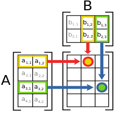

# Preparing code for running on a HPC

We are no longer working on our own computer, so we will need to prepare our code to run on the HPC. For a larger project, this can take many hours and could involve transfering data, building an executable program, and running test cases to make sure that the output of our program is exactly what we want. Our case is a lot simpler, but we still have to make sure that everything works.

In the case of the Pan HPC, we need to use a build node to perform test runs with our program. Since HPCs consist of many computers that are connected in a fast network, they are called "nodes". We will log on to another computer from the login node:
```{bash}
[login-01 ~]$ ssh build-sb
```
~~~ {.output}
[user@build-sb ~]$
~~~

We are now yet again on a different machine:
```{bash}
[user@build-sb ~]$ uname -n
```
~~~ {.output}
build-sb
~~~

Note that we have effectively chained the `ssh` sessions: our computer connects to the login node, and the login node connects to the build node.

We are still in the same user space, since both the login node and the build node have access to the same file system on the network - both computers can see the exact same files:
```
[user@build-sb ~]$ pwd
```
~~~ {.output}
/home/user
~~~

Let's go to our example again and check the Python version that is installed on the system:
```
[user@build-sb ~]$ cd matmul/swcmeethpc
[user@build-sb swcmeethpc]$ python --version
```
~~~ {.output}
Python 2.6.6
~~~

## Matrix Multiplication

Matrix multiplication is a classical performance test for computers: multiplying two N x N (real) matrices requires $N$ multiplications and $N - 1$ additions, which is a total of $2N-1$ "floating-point" operations for each element. We have $N^2$ elements in the matrix and thus need a grand total of $N^2(2N - 1)$ floating-point operations. For large values of $N$ the total number of floating-point operations is approximately $2N^3$, the so-called complexity of matrix multiplication is therefore $O(n^3)$. A fast computer can perform many floating-point operations per second ("FLOPS"), computational performance is thus often measured in FLOPS. Processors in modern laptop computers easily reach several GFLOPS, or billions of floating-point operations per second. Large HPC systems offer PFLOPS, or $10^{15}$ FLOPS.

 <br>
Figure 1 : Schematic diagram of matrix multiplication operation

<br>
Figure 2: Example of square matrix multiplication with $D=2$

More information about computational complexity of mathematical operations is available on Wikipedia: https://en.wikipedia.org/wiki/Computational_complexity_of_mathematical_operations.

Let's look at a simple implementation of matrix multiplication:
```
[user@build-sb ~]$ cat matmulti1.py
```
The algorithm uses three nested loops to compute the output matrix. A timing utility is used to measure the time needed to multiply matrices with $N=100$ rows and columns, repeating the process several times to obtain a mean value.

We can run the example directly on the remote computer:
```
[user@build-sb ~]$ python matmulti1.py
```
~~~ {.python}
Running nested for loops 10 times...
Best runtime [seconds]: 1.035
~~~
The program returns the best time in seconds. Note that this number is influenced by many factors, including the type of computer on which we are running, and if there are other users on the remote computer running programs at the same time.

We can use Python to calculate the FLOPS performance, given that the processor needed to perform about $2N^3=2,000,000$ floating-point operations to compute the result in each iteration:
```
[user@build-sb ~]$ python -c "print(2.e6/1.035)"
```
~~~ {.python}
1932367.14976
~~~
We achieved 1.9 MFLOPS for our example, which is far below the processor's numerical capabilities - this has to do with the way in which Python runs programs, causing the processor to do much more than just floating-point operations.

> ## Challenge
>
> Explain which program runs on which computer when you connect to a remote computer from your own laptop, and then to another remote computer from the first remote one? Which difficulties could appear when you do that? Can you always expect the same file system?